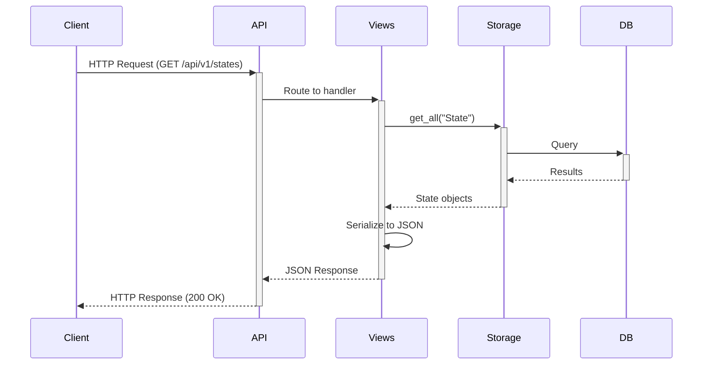
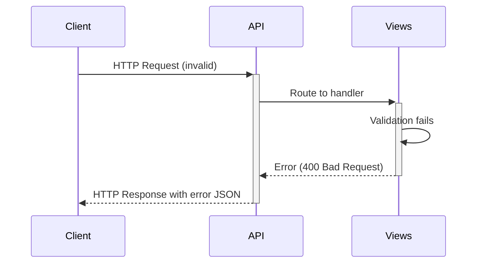

# AirBnB Clone v3 - Architecture Overview

This document describes the architectural design of the AirBnB Clone v3 project, highlighting the RESTful API addition.

## System Architecture

AirBnB Clone v3 extends v2 by adding a RESTful API layer, maintaining the core MVC pattern:

```mermaid
graph TD
    Client[Client] -->|HTTP Request| API[RESTful API]
    Console[Console CLI] -->|Command| Models
    API -->|CRUD Operations| Models[Models]
    Models -->|Storage Operations| Storage[Storage Engine]
    Storage -->|File Operations| FileStorage[File Storage]
    Storage -->|DB Operations| DBStorage[Database Storage]
    
    subgraph "API Layer"
        API --> Routes[API Routes]
        Routes --> Views[Resource Views]
        Views --> Serialization[JSON Serialization]
    end
    
    subgraph "Models"
        Models --> BaseModel[BaseModel]
        BaseModel --> User[User]
        BaseModel --> Place[Place]
        BaseModel --> State[State]
        BaseModel --> City[City]
        BaseModel --> Amenity[Amenity]
        BaseModel --> Review[Review]
    end
```

## Component Details

### API Layer (`api/`)
- **Application**: Flask app with blueprint registration and error handling
- **Versioning**: API routes organized under v1 namespace
- **Views**: Resource handlers for each model type
- **CORS Support**: Cross-Origin Resource Sharing configuration

### Model Enhancements (`models/`)
- **Storage Methods**: New get() and count() methods
- **Serialization**: Improved to_dict() for API responses

### Storage Enhancements (`models/engine/`)
- **Object Retrieval**: Direct object access by ID
- **Object Counting**: Efficient counting with optional class filtering

## API Design

### RESTful Principles
- **Resources**: URLs represent resources (nouns, not verbs)
- **HTTP Methods**: Semantic use of GET, POST, PUT, DELETE
- **Representations**: JSON for all data exchange
- **Statelessness**: No client state stored on server

### Route Structure
```
/api/v1/                         # API root with version
    ├── status                    # API health status
    ├── stats                     # Object count statistics
    ├── states                    # State collection
    │   └── <state_id>            # Individual state
    │       └── cities            # Cities in state
    ├── cities                    
    │   └── <city_id>             
    │       └── places            # Places in city
    ├── amenities                 
    │   └── <amenity_id>          
    ├── users                     
    │   └── <user_id>             
    ├── places                    
    │   └── <place_id>            
    │       ├── amenities         # Amenities in place
    │       └── reviews           # Reviews for place
    ├── reviews                   
    │   └── <review_id>           
    └── places_search             # Search endpoint
```

## Data Flow

### API Request Flow
1. Client sends HTTP request to endpoint
2. Flask routes request to appropriate view function
3. View function validates request data
4. Storage engine retrieves or modifies data
5. Response is serialized to JSON and returned



### Error Handling Flow


## Authentication (Planned)
- **Token-based**: JWT implementation for secure API access
- **Authorization**: Role-based access control for different operations

## Documentation
- **Swagger/Flasgger**: Interactive API documentation
- **OpenAPI Spec**: Standard API description format

## Environmental Configuration
- **API Host/Port**: Configurable through environment variables
- **Storage Type**: File or database storage selection
- **Debug Mode**: Development mode with enhanced logging
